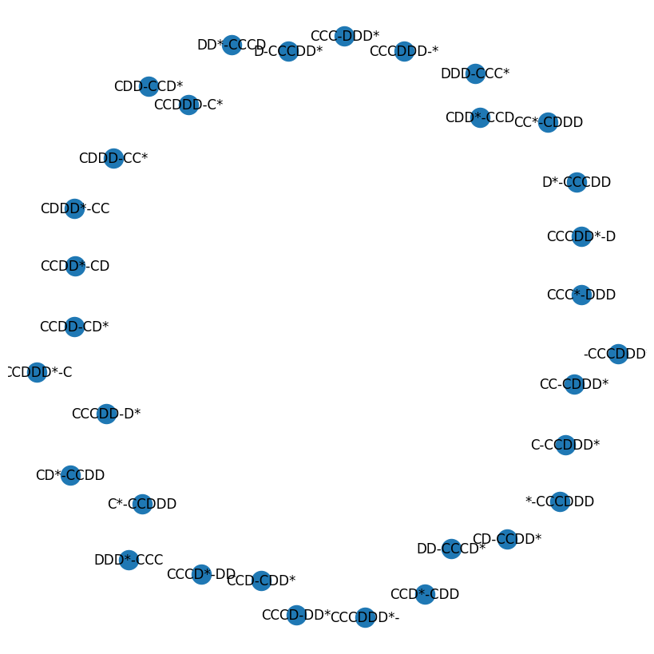
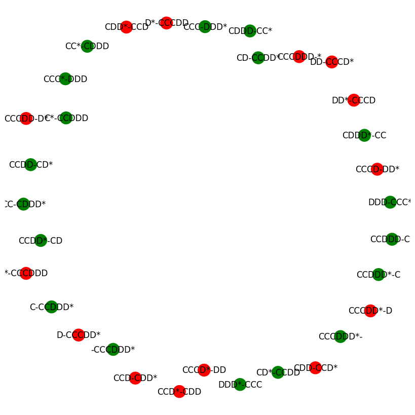
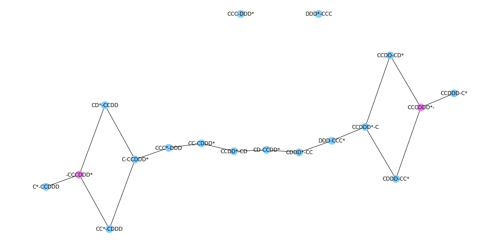

# Six students 
Il problema è legato alla configurazione di gruppi di amici e al trasferimento da una posizione iniziale (sorgente) a una posizione finale (destinazione) in un certo spazio di soluzioni. I dettagli chiave sono:

## Descrizione generale

L'idea principale è rappresentare le configurazioni di gruppi di amici che si trovano in due diverse location: **casa** e **pizzeria**. Ogni configurazione viene rappresentata come un nodo in un grafo, dove gli amici vengono suddivisi tra le due location (casa e pizzeria). Gli amici possono essere di due tipi: amici di tipo `C` e amici di tipo `D`. Il compito è trovare un percorso che li sposti da una configurazione iniziale a una configurazione finale, rispettando alcune regole, utilizzando un algoritmo di percorso minimo (come la ricerca del cammino più breve in un grafo).

### Sezioni del Codice

### 1. **Importazione dei moduli**

```python
from itertools import product, combinations
from multiset import Multiset
import matplotlib.pyplot as plt
import networkx as nx
from networkx.drawing.nx_pydot import graphviz_layout
from icecream import ic
```

Vengono importate diverse librerie:
- **itertools.product e combinations**: per generare tutte le combinazioni possibili degli amici nelle due location.
- **multiset**: per gestire insiemi multivalore (dove gli elementi possono ripetersi).
- **matplotlib.pyplot**: per visualizzare i grafi.
- **networkx**: per creare e manipolare i grafi.
- **icecream**: una libreria utile per il debugging.

### 2. **Funzioni di conversione tra nodi e insiemi**

```python
def node2sets(node):
    home, pizzeria = node.split("-")
    return Multiset(home), Multiset(pizzeria)

def sets2node(home, pizzeria):
    return "".join(sorted(home)) + "-" + "".join(sorted(pizzeria))
```

Queste due funzioni convertono tra:
- **nodi**: rappresentati da una stringa (es. `"C2D1-*"`), dove `C` e `D` rappresentano i due tipi di amici, e `*` rappresenta un punto di interscambio.
- **insiemi**: rappresentano la distribuzione degli amici tra la **casa** e la **pizzeria**, usando `Multiset` per permettere amici duplicati.

### 3. **Generazione dello spazio di ricerca (spazio degli stati)**

```python
sspace = nx.Graph()
for c, d, b in product(range(NUM_FRIENDS // 2 + 1), range(NUM_FRIENDS // 2 + 1), [True, False]):
    home = "C" * c + "D" * d + ("*" if b else "")
    pizzeria = "C" * (NUM_FRIENDS // 2 - c) + "D" * (NUM_FRIENDS // 2 - d) + ("*" if not b else "")
    sspace.add_node(home + "-" + pizzeria)
```

Questa parte del codice genera tutti i nodi del grafo. Ogni nodo rappresenta una configurazione degli amici divisi tra **casa** e **pizzeria**. Vengono considerate tutte le combinazioni possibili, partizionando gli amici di tipo `C` e `D` tra le due location. La presenza o meno del simbolo `*` indica la posizione del punto di interscambio.

### 4. **Visualizzazione del grafo iniziale**

```python
plt.figure(figsize=(8, 8))
nx.draw(sspace, with_labels=True)
```

Viene visualizzato il grafo che rappresenta lo **spazio delle configurazioni** (grafo non validato). Ogni nodo è etichettato con la configurazione di amici tra casa e pizzeria.
Le etichette mostrano la disposizione degli amici, ad esempio "CC*-DD" (2 "C", un asterisco a casa, e 2 "D" alla pizzeria).



### 5. **Funzione di validazione dei nodi**

```python
def valid_node(node):
    home, pizzeria = node.split("-")
    if home == "*" or pizzeria == "*":
        return False
    return valid_location(home) and valid_location(pizzeria)

def valid_location(place):
    if place.count("D") == 0:
        return True
    elif place.count("D") >= place.count("C"):
        return True
    return False
```

Queste funzioni verificano se un nodo rappresenta una configurazione valida. Un nodo è valido se:
- Non contiene solo `*` in casa o in pizzeria.
- Il numero di amici di tipo `D` non è inferiore al numero di amici di tipo `C` (o non ci sono amici di tipo `D`).

### 6. **Visualizzazione dei nodi validi**

```python
plt.figure(figsize=(8, 8))
nx.draw(
    sspace,
    with_labels=True,
    node_color=["green" if valid_node(n) else "red" for n in sspace],
)
```

Vengono evidenziati i nodi validi e non validi nel grafo:
- **Verde**: nodi validi.
- **Rosso**: nodi non validi.



### 7. **Aggiunta degli spostamenti (archi)**

```python
for n1, n2 in combinations(sspace, 2):
    if bike(node2sets(n1), node2sets(n2)) is not None:
        sspace.add_edge(n1, n2, label=bike(node2sets(n1), node2sets(n2)))
```

Qui vengono aggiunti gli **archi** tra i nodi, che rappresentano possibili spostamenti tra le configurazioni degli amici. La funzione `bike` determina se è possibile uno spostamento tra due nodi (verificando che ci sia una differenza accettabile tra le configurazioni).



### 8. **Percorso più breve**

```python
SOURCE = "C" * (NUM_FRIENDS // 2) + "D" * (NUM_FRIENDS // 2) + "*" + "-"
DESTINATION = "-" + "C" * (NUM_FRIENDS // 2) + "D" * (NUM_FRIENDS // 2) + "*"
nx.shortest_path(sspace, SOURCE, DESTINATION)
```

Viene calcolato il **percorso più breve** tra una configurazione di partenza (**SOURCE**) e una configurazione finale (**DESTINATION**), utilizzando la funzione `nx.shortest_path` di NetworkX.