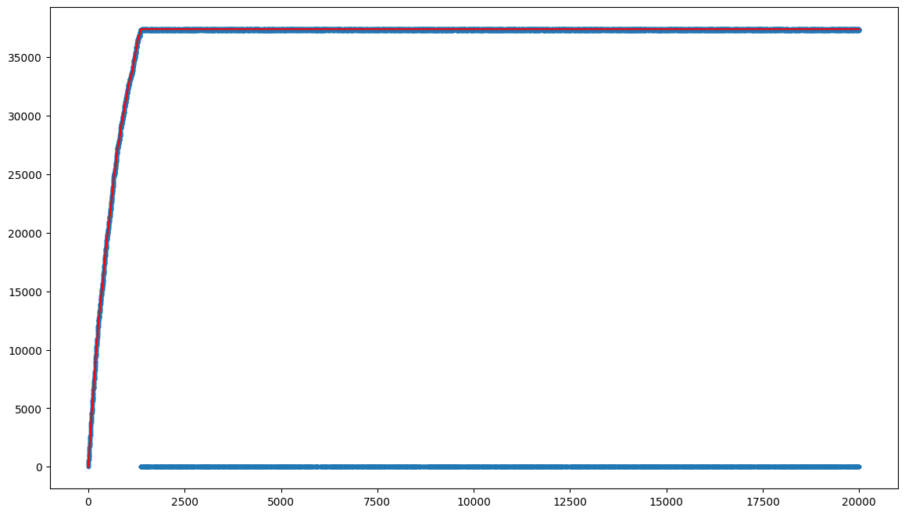
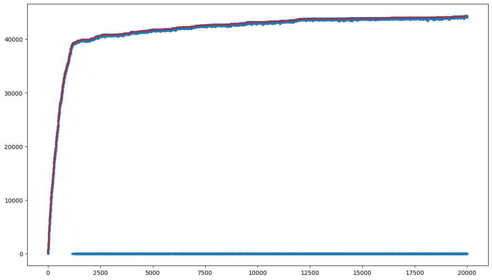
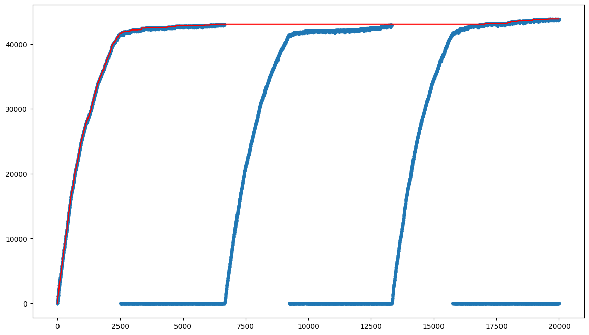

# Documentazione del Notebook: Risoluzione del Problema dello Zaino Multi-Dimensionale 0-1

## Introduzione

Questo notebook affronta la risoluzione del **problema dello zaino multi-dimensionale 0-1** (0-1 Multiple Knapsack Problem). In questo problema, si hanno diversi oggetti, ciascuno con un valore e un peso associato, distribuito su più dimensioni. L'obiettivo è selezionare un sottoinsieme di oggetti per riempire uno o più zaini rispettando i limiti di peso per ciascuna dimensione e massimizzando il valore totale degli oggetti selezionati.

---

## Struttura del Notebook

### 1. Inizializzazione dei Dati

In questa sezione, vengono inizializzati i parametri e i dati necessari per il problema:

- **NUM_ITEMS**: Numero totale di oggetti disponibili (1000 oggetti).
- **DIMENSIONS**: Numero di dimensioni del peso (500 dimensioni per ogni oggetto).
- **WEIGHTS**: Matrice che rappresenta i pesi di ogni oggetto su ciascuna dimensione.
- **VALUES**: Vettore contenente i valori associati agli oggetti.
- **MAX_WEIGHTS**: Limiti massimi di peso per ogni dimensione dello zaino.

```python
WEIGHTS = np.random.randint(1, 50 + 1, size=(NUM_ITEMS, DIMENSIONS))
MAX_WEIGHTS = np.full(DIMENSIONS, NUM_ITEMS * 20)
VALUES = np.random.randint(1, 100 + 1, size=NUM_ITEMS)
```

### 2. Funzione di Valutazione (`evaluate`)

La funzione di valutazione prende in input una soluzione candidata e restituisce il valore totale degli oggetti selezionati, verificando che i vincoli di peso siano rispettati. Se i vincoli non vengono rispettati, la funzione restituisce un punteggio negativo proporzionale alla violazione dei limiti di peso.

```python
def evaluate(knapsack):
    if all(np.sum(WEIGHTS[knapsack], axis=0) < MAX_WEIGHTS):
        return np.sum(VALUES[knapsack])
    else:
        return -sum(np.sum(WEIGHTS[knapsack], axis=0) > MAX_WEIGHTS)
```

### 3. Algoritmi di Ottimizzazione

#### 3.1. Algoritmo di Random-Mutation Hill Climber (RMHC)

L'algoritmo RMHC inizia con una soluzione vuota e, ad ogni iterazione, modifica un singolo oggetto della soluzione attuale (includendolo o escludendolo dallo zaino). Se la nuova soluzione è migliore della precedente, viene accettata. Viene mantenuta una cronologia delle valutazioni per monitorare l'andamento dell'algoritmo.

```python
solution = np.full(NUM_ITEMS, False)
history = [evaluate(solution)]
for n in tqdm(range(MAX_STEPS)):
    new_solution = solution.copy()
    index = np.random.randint(0, NUM_ITEMS)
    new_solution[index] = not new_solution[index]
    history.append(evaluate(new_solution))
    if evaluate(new_solution) > evaluate(solution):
        solution = new_solution
```

##### Output Finale RMHC

```plaintext
ic| evaluate(solution): np.int64(37396)
ic| history.index(evaluate(solution)): 1544
```

#### 3.2. Algoritmo RMHC con `Tweak` Avanzato

Viene introdotta una versione avanzata della funzione di modifica (`tweak`), che permette di modificare un numero variabile di oggetti ad ogni iterazione. Questo migliora l'esplorazione dello spazio delle soluzioni.

```python
def tweak(solution):
    new_solution = solution.copy()
    index = None
    while index is None or np.random.random() < 0.4:
        index = np.random.randint(0, NUM_ITEMS)
        new_solution[index] = not new_solution[index]
    return new_solution
```

```python
solution = np.full(NUM_ITEMS, False)
history = [evaluate(solution)]
for n in tqdm(range(MAX_STEPS)):
    new_solution = tweak(solution)
    history.append(evaluate(new_solution))
    if evaluate(new_solution) > evaluate(solution):
        solution = new_solution
```

##### Output Finale RMHC con Tweak Avanzato

```plaintext
ic| evaluate(solution): np.int64(44527)
ic| history.index(evaluate(solution)): 19518
```

#### 3.3. Algoritmo Steepest Step con Restart

In questa variante, l'algoritmo esplora molte soluzioni candidate ad ogni passo e seleziona quella con il miglior miglioramento (la "maggior salita"). Inoltre, viene introdotto un meccanismo di restart per evitare che l'algoritmo rimanga bloccato in un massimo locale.

```python
NUM_RESTARTS = 3
STEEPEST_STEP_CANDIDATES = 5
for i in tqdm(range(NUM_RESTARTS)):
    solution = np.full(NUM_ITEMS, False)
    for n in tqdm(range(TRUE_MAX_STEPS // NUM_RESTARTS)):
        candidates = [tweak(solution) for i in range(STEEPEST_STEP_CANDIDATES)]
        candidates_fitness = [evaluate(c) for c in candidates]
        idx = candidates_fitness.index(max(candidates_fitness))
        new_solution = candidates[idx]
        if evaluate(new_solution) > evaluate(solution):
            solution = new_solution
```

##### Output Finale Steepest Step con Restart

```plaintext
ic| evaluate(best_solution): np.int64(43860)
ic| history.index(evaluate(best_solution)): 19620
```

---

## Risultati

I risultati riportati rappresentano l'output di diverse esecuzioni degli algoritmi di ottimizzazione per il **problema dello zaino multi-dimensionale 0-1**. Di seguito, vengono spiegati i risultati passo dopo passo, includendo i grafici generati durante l'esecuzione.

### Risultati di **Random-Mutation Hill Climber (RMHC) Senza Strength**:

1. **Prima esecuzione dell'algoritmo**:

    ```plaintext
    ic| evaluate(solution): np.int64(37396)
    ic| history.index(evaluate(solution)): 1544
    ```

    - **Valore della soluzione**: Alla fine dell'algoritmo RMHC (primo ciclo di ottimizzazione), la qualità della soluzione trovata è **37396**.
    - **Indice della soluzione**: La soluzione ottimale è stata trovata dopo **1544 iterazioni**.
    - Questo indica che l'algoritmo ha raggiunto una qualità di 37396 entro i primi 1544 passi (su un totale di 20.000 iterazioni).

2. **Seconda esecuzione dell'algoritmo**:

    ```plaintext
    100% 20000/20000 [00:37<00:00, 535.58it/s]
    ic| evaluate(solution): np.int64(44328)
    ic| history.index(evaluate(solution)): 19941
    ```

    - **Valore della soluzione**: Alla fine della seconda esecuzione di RMHC, la qualità della soluzione migliorata è **44328**.
    - **Indice della soluzione**: Questa qualità è stata raggiunta quasi alla fine delle iterazioni, precisamente al passo **19.941** su **20.000** iterazioni totali.
    - Questo indica che la soluzione ottimale è stata trovata molto tardi, segnalando che l'algoritmo ha continuato a migliorare fino alle ultime iterazioni.

3. **Terza esecuzione dell'algoritmo**:

    ```plaintext
    ic| evaluate(solution): np.int64(44527)
    ic| history.index(evaluate(solution)): 19518
    ```

    - **Valore della soluzione**: In questa esecuzione, la soluzione ottimale ha un valore leggermente superiore, **44527**.
    - **Indice della soluzione**: Anche qui, la soluzione ottimale è stata trovata verso la fine del processo, al passo **19.518**.
    - Questo suggerisce che l'algoritmo ha esplorato soluzioni diverse, trovando un miglioramento graduale.

### Risultati di **Steepest Step con Restart**:

Dopo il primo algoritmo RMHC, viene eseguito un algoritmo basato su **Steepest Step con Restart**, che cerca di migliorare ulteriormente la qualità della soluzione. Viene riavviato più volte per evitare di rimanere bloccati in massimi locali.

1. **Step 1**:

    ```plaintext
    ic| evaluate(solution): np.int64(43034)
    ```

    - **Valore della soluzione**: Dopo il primo restart, la qualità della soluzione trovata è **43034**.
    - L'algoritmo sta cercando di migliorare ulteriormente partendo da zero in ogni restart.

2. **Step 2**:

    ```plaintext
    ic| evaluate(solution): np.int64(42933)
    ```

    - **Valore della soluzione**: Dopo il secondo restart, la qualità della soluzione è leggermente inferiore, **42933**.
    - Questo suggerisce che non tutti i restart portano a soluzioni migliori.

3. **Step 3**:

    ```plaintext
    ic| evaluate(solution): np.int64(43860)
    ```

    - **Valore della soluzione**: Al terzo restart, la qualità della soluzione migliora fino a **43860**.

### Valutazione della **best_solution**:

```plaintext
ic| evaluate(best_solution): np.int64(43860)
ic| history.index(evaluate(best_solution)): 19620
```

- **Soluzione migliore**: Alla fine dell'intero processo (incluse le strategie con restart), la migliore soluzione trovata ha un valore di **43860**.
- **Indice della best_solution**: Questa soluzione è stata trovata al passo **19.620** della cronologia.

### Riepilogo Generale:

- **Algoritmo RMHC Senza Strength**:
  - Ha trovato soluzioni valide con costi variabili, raggiungendo un costo massimo di **44527**.
  - In alcune iterazioni avanzate, l'algoritmo ha generato soluzioni non valide.
  
- **Algoritmo Steepest Step con Restart**:
  - Ha migliorato la soluzione a **43860**, ma con restart intermedi che non sempre hanno portato a soluzioni migliori.
  - L'introduzione dei restart ha permesso all'algoritmo di esplorare nuove regioni dello spazio delle soluzioni, evitando di rimanere bloccato in massimi locali.

- **Conclusione Generale**:
  - L'algoritmo **RMHC** ha dimostrato una buona capacità di miglioramento, raggiungendo soluzioni valide con valori crescenti fino alla fine delle iterazioni.
  - L'algoritmo **Steepest Step con Restart** ha mostrato un'efficacia nel migliorare ulteriormente le soluzioni, grazie alla capacità di evitare stagnazioni in massimi locali, anche se non sempre ogni restart ha portato a miglioramenti.

---

## Analisi dei Grafici

Di seguito sono riportati i grafici generati durante l'esecuzione degli algoritmi, insieme a una descrizione e analisi dettagliata di ciascuno.

### 1. **Primo Grafico (output1.png)**



- **Descrizione**: 
  Questo grafico rappresenta l'evoluzione della qualità della soluzione durante l'esecuzione dell'algoritmo RMHC standard. La linea rossa mostra il miglioramento massimo accumulato fino a quel momento, mentre i punti blu rappresentano le singole soluzioni esplorate a ogni iterazione.
  
- **Osservazione**: 
  La crescita della qualità è molto rapida nei primi 2000 passi, con un miglioramento sostanziale, fino a raggiungere un valore intorno a **37.396**. Dopo i primi passi, la linea rossa si stabilizza, indicando che l'algoritmo non riesce più a trovare soluzioni migliori. I punti blu piatti (vicino a **0**) indicano iterazioni in cui la soluzione trovata non è valida (probabilmente a causa della violazione dei vincoli di peso).

---

### 2. **Secondo Grafico (output2.png)**



- **Descrizione**: 
  Questo grafico mostra l'evoluzione della qualità della soluzione durante la seconda esecuzione dell'algoritmo RMHC standard. La linea rossa indica il miglioramento massimo accumulato, mentre i punti blu rappresentano le soluzioni esplorate.
  
- **Osservazione**: 
  L'algoritmo sembra comportarsi meglio rispetto al primo grafico, con un valore massimo più alto, **44.328**. La crescita iniziale è veloce e continua a migliorare quasi fino alla fine delle iterazioni, suggerendo una maggiore esplorazione e ottimizzazione.

---

### 3. **Terzo Grafico (output3.png)**


- **Descrizione**: 
  Questo grafico illustra l'evoluzione della qualità della soluzione durante la terza esecuzione dell'algoritmo RMHC standard. La linea rossa traccia il miglioramento massimo accumulato, mentre i punti blu rappresentano le soluzioni esplorate.
  
- **Osservazione**: 
  L'algoritmo continua a migliorare, raggiungendo un valore massimo di **44.527**. La crescita è ancora presente, ma più lenta rispetto alle prime esecuzioni, indicando che l'algoritmo sta raffinando la ricerca delle soluzioni ottimali.

---

### 4. **Quarto Grafico (output4.png)**



- **Descrizione**: 
  Questo grafico mostra l'effetto della strategia di **Steepest Step con Restart**. La linea rossa rappresenta il miglioramento massimo accumulato, mentre i punti blu indicano le soluzioni esplorate durante i vari restart.
  
- **Osservazione**: 
  Si osservano chiaramente i 3 picchi evidenti, corrispondenti ai 3 restart effettuati. Ogni picco indica una nuova fase di esplorazione in cui l'algoritmo trova soluzioni valide e migliora rapidamente, raggiungendo valori ottimali intorno a **43.034** e **43.860** nelle esecuzioni finali. Questo comportamento dimostra l'efficacia della strategia di restart nel evitare che l'algoritmo rimanga bloccato in massimi locali e nel favorire una migliore esplorazione dello spazio delle soluzioni.

---

### Conclusione:

1. **Crescita Rapida Iniziale**: In tutti i grafici, la qualità della soluzione migliora molto rapidamente nelle prime fasi dell'algoritmo. Questo è tipico nei problemi di ottimizzazione, dove le soluzioni iniziali sono spesso lontane dal massimo e piccoli cambiamenti possono portare grandi miglioramenti.

2. **Soluzioni Non Valide**: I punti blu piatti indicano soluzioni non valide, che non soddisfano i vincoli di peso del problema knapsack. Questi punti mostrano che l'algoritmo continua a esplorare, ma le soluzioni non sono accettate.

3. **Strategia di Restart (nel Quarto Grafico)**: Il quarto grafico mostra chiaramente l'effetto dei restart, in cui l'algoritmo ricomincia da una nuova soluzione iniziale, evitando di rimanere bloccato in massimi locali e migliorando ulteriormente la qualità.

Nel complesso, questi grafici forniscono un'idea visiva di come l'algoritmo esplora lo spazio delle soluzioni e come le diverse strategie (come il tweak potenziato o il restart) influenzano il processo di ottimizzazione.

---